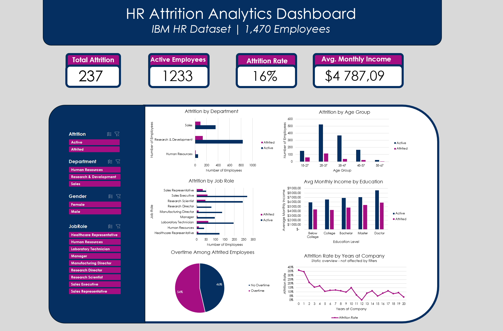

# HR Attrition Dashboard

An interactive HR analytics dashboard built in **Microsoft Excel** using PivotTables, PivotCharts, and Slicers. The project analyzes employee attrition patterns across a workforce of 1,470 employees to identify key drivers of turnover.



---

## Dataset

The dataset (`WA_Fn-UseC_-HR-Employee-Attrition.csv`) contains **1,470 employee records** with 35 features sourced from the IBM HR Analytics dataset.

**Key columns used in analysis:**

| Column | Description |
|---|---|
| `Attrition` | Whether the employee left (Yes/No) |
| `Department` | Human Resources, R&D, Sales |
| `JobRole` | 9 distinct job roles |
| `Age` | Employee age (grouped: 18-67) |
| `OverTime` | Whether employee worked overtime |
| `MonthlyIncome` | Gross monthly salary |
| `Education` | Education level (1-5 scale) |
| `YearsAtCompany` | Tenure in years |
| `Gender` | Male / Female |

---

## Dashboard Overview

The dashboard consists of **6 charts** and **4 KPI cards**, all connected to interactive slicers.

### KPI Cards
- **Total Attrition** - 237 employees left
- **Active Employees** - 1,233 currently active
- **Attrition Rate** - 16%
- **Avg. Monthly Income** - across all employees

### Charts

| # | Chart | Type | Description |
|---|---|---|---|
| 1 | Attrition by Department | Bar | Compares active vs. attrited employees per department |
| 2 | Attrition by Age Group | Bar | Breakdown across 5 age ranges (18–67) |
| 3 | Attrition by Job Role | Bar | All 9 roles, active vs. attrited |
| 4 | Avg Monthly Income by Education | Bar | Income gap between active and attrited by education level |
| 5 | Overtime Among Attrited Employees | Pie | 54% of attrited employees worked overtime |
| 6 | Attrition Rate by Years at Company | Line | Static overview - highest attrition in first 2 years (~35%) |

> **Note:** Chart 6 (Attrition Rate by Years at Company) is intentionally disconnected from slicers to always show a company-wide static overview. Chart 5 (Overtime) is disconnected from the first slicer - it always displays overtime distribution among attrited employees only.

---

## Key Findings

- **Sales Representatives** have the highest attrition count relative to their department size
- Attrition is highest in the **18-27 and 28-37** age groups
- Employees who worked **overtime are 54%** of all attrited employees
- Attrition rate drops significantly after **3 years at the company**
- Attrited employees earn **consistently less** across every education level compared to active ones

---

## Slicers / Filters

The dashboard supports interactive filtering via 4 slicers:

- **Attrition** - Active / Attrited / All
- **Department** - Human Resources / R&D / Sales
- **Gender** - Female / Male
- **Job Role** - 9 job roles

---

## Tools Used

- **Microsoft Excel** - PivotTables, PivotCharts, Slicers, conditional formatting
- **Dataset** - IBM HR Analytics Employee Attrition & Performance (public domain)

---

## File Structure

```
hr-attrition-dashboard/
│
├── hr-attrition.xlsx # Main Excel file with raw data, pivot tables & dashboard
├── dashboard.png # Screenshot of the dashboard
├── WA_Fn-UseC_-HR-Employee-Attrition.csv # Used dataset
└── README.md
```

---

## How to Use

1. Download `hr-attrition.xlsx`
2. Open in **Microsoft Excel**
3. Navigate to the **DASHBOARD** sheet
4. Use the slicers on the left to filter all charts simultaneously
